# Empirical Investigation of 1-D ULA Bias Dependence on Convexity Parameter, $\alpha$

**Author:** Michael Kang
**Date:** October 2025

-----

## 1\. Introduction

This software package implements an empirical framework to quantify the bias and convergence properties of the Unadjusted Langevin Algorithm (ULA) when applied to target distributions $\pi \propto e^{-V(x)}$ that violate the standard assumption of uniform strong log-concavity. Specifically, it investigates the regime where the potential $V(x)$ exhibits "mere" convexity (non-strong convexity/degenrate convexity).

It could be argued that the class of 'mere' convex of potentials is not ideal to study. 
For example:
-  $\{x | \nabla^2 V(x) = 0\}$ might be of measure 0; 
- It could be attained only very locally (by locally I mean $\{x | \nabla^2 V(x) = 0\} \subset \mathit{B}(c^*, r)$ with $r < \infty$);
- We might have vanishing curvature, $\nabla^2 V \rightarrow 0$ as $x \rightarrow \infty$;
- Asympototically in the tail;
- Or: even some oscillation behavior between strong and 'mere' convex in the tail.

We propose different potential functions that capture all the above scenarios in this project to examine whether *ULA asymptotic bias is uniform in the convexity parameter $\alpha$*, especially in the case $\alpha \rightarrow 0$, marking the degeneration from strong convexity to convexity.

We also found a quite surpring phenomenon of slow mixing of LMC chain with a convex-in-the-tail, locally-non-convex, smooth potential, whose convergence rate is very sensitive to $\alpha$.

## 2\. Preliminaries

### 2.1. Langevin Dynamics and ULA

We consider the overdamped Langevin diffusion in $\mathbb{R}^d$ (here $d=1$):
$$dX_t = -\nabla V(X_t) dt + \sqrt{2} dB_t, \quad X_0 \sim \mu_0$$
where $B_t$ is a standard Brownian motion. Under mild conditions on $V$, the process admits a unique invariant measure $\pi(dx) \propto e^{-V(x)} dx$.

The Unadjusted Langevin Algorithm (ULA) is the Euler-Maruyama discretization of this SDE with step size $h > 0$:
$$X_{k+1} = X_k - h \nabla V(X_k) + \sqrt{2h} \xi_k, \quad \xi_k \sim \mathcal{N}(0, I_d)$$
This discrete chain converges to a stationary distribution $\pi_h$, which differs from $\pi$. The bias is defined as the discrepancy between $\pi_h$ and $\pi$.

### 2.2. Classes of Potentials
Assume $V$ is $L$-smooth and $m$-strongly convex:
$$m I \preceq \nabla^2 V(x) \preceq L I$$
To systematically analyze the bias dependence on $\alpha$, we construct a parametric family of potentials $\mathcal{V} = \{V_{\alpha, \beta} : \mathbb{R} \to \mathbb{R}\}$ that violate the strict strong convexity assumption $\nabla^2 V \succeq m > 0 I$ in distinct topological regimes. We classify these potentials based on the locus of their curvature degeneration.

#### 2.2.1. Regime I: Local Weak Convexity (Vanishing Curvature at the Mode)
This class models distributions with "flat bottoms," where the potential is strongly convex in the tails but exhibits degenerate convexity near the mode. We define $V_{\text{loc}} \in C^{\infty}(\mathbb{R})$ via a regularized interpolation:

$$
V_{\text{loc}}(x) = \frac{\beta}{2}x^2 - (\beta - \alpha)\log(\cosh(x))
$$

The Hessian (second derivative) is given by:
$$
V_{\text{loc}}''(x) = \beta - (\beta - \alpha)\text{sech}^2(x)
$$

**Analysis:**
* **Local Behavior:** At the origin, $V_{\text{loc}}''(0) = \alpha$. As $\alpha \to 0$, the potential locally resembles a quartic well ($x^4$), leading to a vanishing spectral gap at the mode while retaining strong confinement in the tails.
* **Asymptotic Behavior:** As $|x| \to \infty$, $\text{sech}(x) \to 0$, implying $V_{\text{loc}}''(x) \to \beta$. The invariant measure $\pi \propto e^{-V}$ maintains sub-Gaussian tails $\pi(x) \sim e^{-\frac{\beta}{2}x^2}$, ensuring uniform geometric ergodicity despite the local degeneracy.

#### 2.2.2. Regime II: Global Weak Convexity (Vanishing Curvature in the Tails)
This class examines the loss of strong convexity asymptotically. The potential is strongly curved near the mode but transitions to weak convexity (or linearity) in the far field.

$$
V_{\text{glob}}(x) = \frac{\alpha}{2}x^2 + (\beta - \alpha)\log(\cosh(x))
$$

With second derivative:
$$
V_{\text{glob}}''(x) = \alpha + (\beta - \alpha)\text{sech}^2(x)
$$

**Analysis:**
* **Local Behavior:** At $x=0$, curvature is maximal with $V_{\text{glob}}''(0) = \beta$.
* **Asymptotic Behavior:** As $|x| \to \infty$, $V_{\text{glob}}''(x) \to \alpha$. In the limit $\alpha \to 0$, the quadratic term vanishes, and the potential exhibits linear growth $V(x) \sim \beta|x|$. This results in a heavy-tailed invariant measure (Laplace-type).
#### 2.2.3. Regime III: Asymmetric Non-Convexity (Smoothed)
To investigate the impact of negative curvature regions (concavity) while maintaining global confinement and rigorous $C^2$ continuity (to avoid artifacts in bias scaling), we utilize a smoothed asymmetric potential. This potential stitches a non-convex cosine core to quadratic/linear tails via a cubic spline transition region of width $\delta$.

$$
V_{\text{asym}}(x) \approx 
\begin{cases} 
-\beta \cos(\pi x) & |x| \le R \\
\text{Cubic Spline Transition} & R < |x| < R+\delta \\
\frac{\alpha}{2}(|x|-R)^2 + \dots & |x| \ge R+\delta
\end{cases}
$$

**Smoothness Construction:**
To ensure the Hessian $V''(x)$ is continuous, we linearly interpolate the curvature in the transition region $[R, R+\delta]$ from the boundary curvature $V''(R) = \beta \pi^2 \cos(\pi R)$ to the tail convexity $\alpha$.

**Analysis:**
* **Metastability:** The core region contains areas of negative curvature, creating a local potential well that traps the Langevin particle.
* **Tail Behavior:** By setting $\alpha \to 0$ in the tails, we create a regime where the particle must escape a local trap to explore a heavy-tailed (linear growth) landscape, providing a rigorous test for ULA mixing times.

#### 2.2.4. Regime IV: Oscillating Tail Convexity (Perturbed Quadratic)
To study potentials where the strong convexity condition is violated periodically rather than asymptotically, we introduce a Globally Smooth Perturbed Quadratic potential. This replaces piecewise definitions with a $C^\infty$ formulation that oscillates between "mere" convexity $\alpha$ and "strong" convexity $\beta$.

$$
V_{\text{osc}}(x) = \frac{A}{2}x^2 + \lambda \cos(\omega x)
$$

The parameters $A$ (base quadratic) and $\lambda$ (perturbation amplitude) are derived such that the second derivative $V''(x)$ oscillates precisely within the bounds $[\alpha, \beta]$:
$$
V''(x) = A - \lambda \omega^2 \cos(\omega x)
$$

**Analysis:**
* **Convexity Bounds:** $\inf V''(x) = \alpha$ and $\sup V''(x) = \beta$.
* **Degenerate Limit:** As $\alpha \to 0$, the potential retains global quadratic confinement on average ($A \approx \beta/2$), but the local convexity vanishes periodically. This tests whether the "average" strong convexity is sufficient for standard convergence rates, or if the periodic degenerate regions introduce significant bias.
-----
### 2.3. Error Metrics

To quantify convergence and bias, we utilize the following metrics:

  * **2-Wasserstein Distance ($W_2$):**
    For $d=1$, $W_2$ has a closed form involving the quantile functions (inverse CDFs) $F^{-1}$:
    $$W_2^2(\mu, \nu) = \int_0^1 \left| F_\mu^{-1}(u) - F_\nu^{-1}(u) \right|^2 du$$
    This metric is sensitive to tail behavior and moment convergence.

  * **Kullback-Leibler Divergence (KL):**
    $$\text{KL}(\hat{\pi} || \pi) = \int \hat{\pi}(x) \log \left( \frac{\hat{\pi}(x)}{\pi(x)} \right) dx$$
    Estimated via Kernel Density Estimation (KDE) with Silverman's bandwidth selection.

  * **Autocorrelation and Effective Sample Size (ESS):**
    The statistical efficiency is measured via the integrated autocorrelation time $\tau_{\text{int}}$:
    $$\text{ESS} = \frac{N}{1 + 2 \sum_{k=1}^\infty \rho_k}$$
    where $\rho_k$ is the autocorrelation at lag $k$, estimated using Geyer's initial positive sequence method.

-----

## 3\. Implementation Details

### 3.1. Numerical Ground Truth

Because we analyze perturbations where analytical moments are intractable, the code computes the "True" distribution $\pi$ using adaptive Gauss-Kronrod quadrature (`QuadGK`).

1.  **Normalization:** $Z = \int_{-\infty}^\infty e^{-V(x)} dx$.
2.  **Moments:** $\mathbb{E}[x], \text{Var}(x)$.
3.  **Quantiles:** The CDF $F(x)$ is computed on a high-resolution grid and inverted numerically to allow precise $W_2$ calculation.

### 3.2. Discrete Approximation (Mesh-Based Ground Truth)

To rigorously decouple the **asymptotic bias** (inherent to the step size $h$) from the **Monte Carlo variance** (inherent to finite sampling time $T$), we implement a deterministic numerical solver for the stationary distribution of the ULA Markov chain.

The ULA chain is a Markov process with the transition kernel $Q_h(x, dy)$, defined by the Gaussian density:
$$
q_h(x, y) = \frac{1}{\sqrt{4\pi h}} \exp\left( -\frac{|y - (x - h\nabla V(x))|^2}{4h} \right)
$$
Instead of simulating sample paths, we approximate the evolution of the density $\rho$ under the dual operator (the discrete Fokker-Planck equivalent). We discretize the domain $\Omega = [-L, L]$ onto a uniform grid $\mathcal{G}_N = \{x_1, \dots, x_N\}$ with mesh size $\Delta x$. The effective support $L$ is chosen adaptively based on the potential's confinement scale, $L \approx 10 \cdot (\alpha + \epsilon)^{-1/2}$.

We construct a row-stochastic transition matrix $\mathbf{P} \in \mathbb{R}^{N \times N}$ where the entry $P_{ij}$ approximates the probability of transitioning from bin $i$ to bin $j$:

$$
P_{ij} \approx \int_{x_j - \frac{\Delta x}{2}}^{x_j + \frac{\Delta x}{2}} q_h(x_i, y) \, dy \approx q_h(x_i, x_j) \Delta x
$$

**Implementation Specifics:**
1.  **Sparsity:** To maintain computational feasibility for large $N$, we enforce sparsity. For a given $x_i$, the transition mass is concentrated around the drift location $\mu_i = x_i - h\nabla V(x_i)$. We truncate the kernel interactions at $5\sigma = 5\sqrt{2h}$, setting $P_{ij} = 0$ if $|x_j - \mu_i| > 5\sigma$.
2.  **Normalization:** We explicitly enforce $\sum_j P_{ij} = 1$ to prevent probability leakage at the boundaries, effectively imposing reflecting boundary conditions on the domain truncation.
3.  **Stationary Solution:** The invariant measure $\pi_h$ of the ULA chain corresponds to the left eigenvector of $\mathbf{P}$ with unit eigenvalue. We solve for $\pi_{\text{discrete}}$ via power iteration:
    $$
    \pi^{(k+1)} = \pi^{(k)} \mathbf{P}
    $$
    Convergence is determined by $\|\pi^{(k+1)} - \pi^{(k)}\|_1 < \text{tol}$.

This method yields a noise-free approximation of the biased limit $\pi_h$. By calculating $W_2(\pi_{\text{discrete}}, \pi_{\text{true}})$, we isolate the discretization error caused by the non-adjustability of the Langevin step, distinct from sampling noise.

### 3.3. Convergence Rate Analysis

The function `analyze_convergence_rate` empirically estimates the contraction rate of the Markov semigroup. We initialize an ensemble of $M$ independent chains ($M \approx 5000$) drawn from a diffuse initialization $\mu_0 \sim \mathcal{N}(0, 5^2)$.

At logarithmic time intervals $t_k$, we estimate the measure $\mu_{t_k}$ via the empirical distribution of the ensemble and compute the Wasserstein distance to the target:

$$
\mathcal{E}(t) = W_2(\text{Law}(X_t), \pi)
$$

This allows us to categorize the convergence behavior based on the convexity regime:
* **Exponential Convergence:** $\mathcal{E}(t) \le C e^{-\lambda t}$ (characteristic of Log-Sobolev Inequality holding, $\alpha > 0$).
* **Polynomial Convergence:** $\mathcal{E}(t) \le C t^{-\gamma}$ (characteristic of weak Poincaré inequalities, $\alpha \to 0$ or heavy tails).

-----

## 4\. Execution Guide

### 4.1. Dependencies

Ensure the following packages are installed in your environment:

```julia
using Pkg
Pkg.add(["LinearAlgebra", "Statistics", "Random", "Distributions", 
         "QuadGK", "StatsBase", "Interpolations", "CSV", 
         "DataFrames", "Plots", "ProgressMeter", "JLD2", 
         "SparseArrays", "Printf", "Logging"])
```

### 4.2. Running the Simulation

Execute it from the terminal:

```bash
julia test.jl
```

### 4.3. Outputs

The execution creates a directory `ula_bias_results/` with the following sub-structure:

  * **`detailed_analysis/`**: Contains `.csv` and `.jld2` files with raw metrics (Bias vs $\alpha$).
  * **`visualizations/`**:
      * `alpha_dependence_*.png`: Log-log plots of $W_2$ and KL bias against convexity $\alpha$.
      * `convergence_*.png`: Convergence rates over time.
      * `cdf/pdf_at_step_*.png`: Histograms of the chain evolution compared to the true analytical density.

### 4.4. Configuration Parameters

Key hyperparameters are defined at the bottom of the script in the global scope:

  * `H_STEP_SIZE` ($h$): Discretization step (default: $5 \times 10^{-4}$).
  * `ALPHA_VALUES`: The grid of convexity parameters to sweep (includes $\alpha=0$).
  * `H_NUM_ITERATIONS`: Total steps for the stationary bias measurement (default: $10^7$).
  * `CONV_N_CHAINS`: Ensemble size for convergence rate estimation (default: 5000).

## 5\. Results and Interpretation

This section presents the empirical results of the ULA bias quantification. For each topological regime, we display:
1.  **Bias vs. Convexity ($\alpha$):** A log-log plot showing the scaling of $W_2$ and KL bias as $\alpha \to 0$.
2.  **Convergence Rate:** The temporal evolution of $W_2(\mu_t, \pi)$ for varying $\alpha$, highlighting the transition from exponential to polynomial convergence.
3.  **Qualitative Evolution:** Snapshots of the empirical density ($\pi_{ULA}$) converging to the true density ($\pi$) from transient state (Step 1,000) to stationary state (Step 1,000,000).

### 5.1. Regime I: Local Weak Convexity
*Characterized by a "flat bottom" (locally degenerate Hessian) with strong confinement in the tails.*

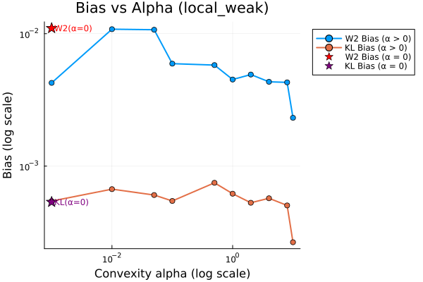
*Figure 1: Bias scaling for Local Weak Potential. Note the distinct behavior of $W_2$ (sensitive to the widening variance) versus KL divergence.*


*Figure 2: Convergence rates. Even with $\alpha \to 0$, the strong tails ensure relatively fast convergence compared to global weak cases.*

### 5.2. Regime II: Global Weak Convexity
*Characterized by strong local curvature but asymptotically vanishing curvature (linear tails).*

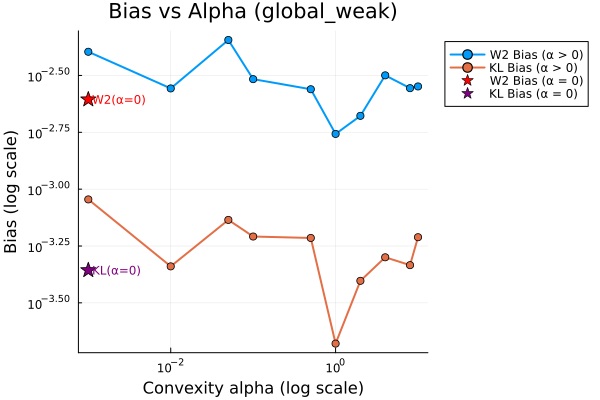
*Figure 3: Bias scaling for Global Weak Potential. The $W_2$ bias is significantly more pronounced here due to the heavy-tailed nature of the target distribution.*

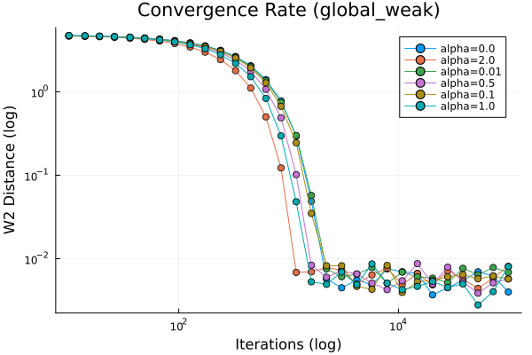
*Figure 4: Convergence rates. We observe a transition to polynomial convergence (slower decay) as $\alpha \to 0$, consistent with sub-geometric ergodicity.*

### 5.3. Regime III: Asymmetric Non-Convexity (Smoothed)
*Characterized by a local non-convex "dimple" and linear tails, smoothed to ensure $C^2$ continuity.*

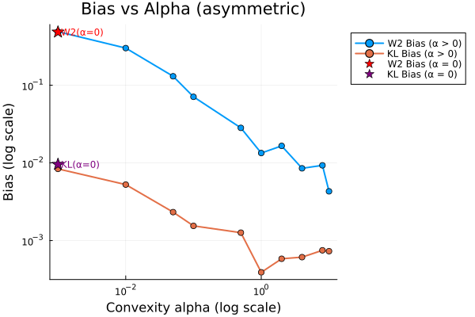
*Figure 5: Bias scaling for the Smoothed Asymmetric Potential. The interplay between the local barrier and the weak tails creates a complex bias landscape.*

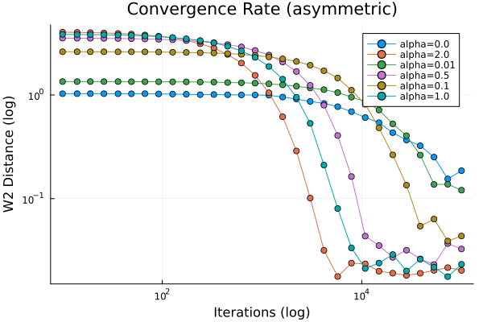
*Figure 6: Convergence rates. For small $\alpha$, the chain exhibits metastability, struggling to traverse the negative curvature region to explore the tails.*

### 5.4. Regime IV: Oscillating Tail Convexity (Perturbed)
*Characterized by global quadratic confinement perturbed by a cosine term, creating an oscillating curvature profile.*

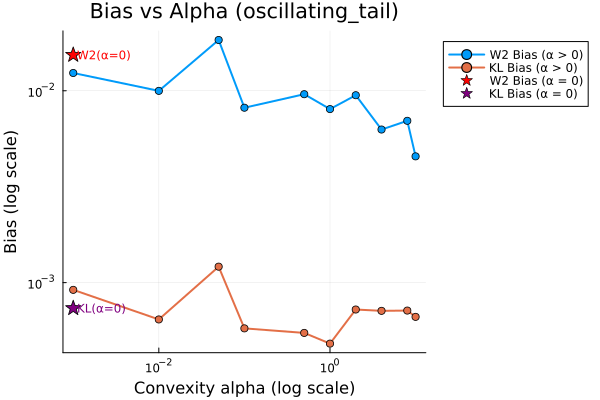
*Figure 7: Bias scaling for the Perturbed Quadratic Potential. The oscillations introduce periodic barriers that effectively increase the apparent bias.*


*Figure 8: Convergence rates. Despite the local oscillations, the global quadratic envelope preserves exponential convergence rates, though with a worse constant than the unperturbed case.*

---

### 5.5. Qualitative Density Evolution (Example at $\alpha=0.01$)

To verify the mixing properties and the validity of the stationary approximation, we visualize the evolution of the chain at the "Transient" phase ($N=1,000$) versus the "Stationary" phase ($N=1,000,000$).

**Regime I: Local Weak Potential**
| Transient ($N=10^3$) | Stationary ($N=10^6$) |
| :---: | :---: |
| 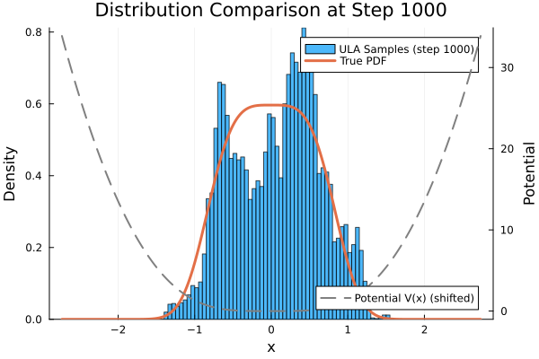 | 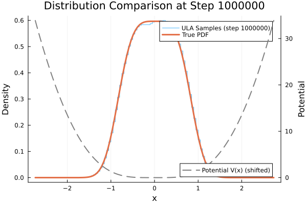 |

**Regime II: Global Weak Potential**
| Transient ($N=10^3$) | Stationary ($N=10^6$) |
| :---: | :---: |
| 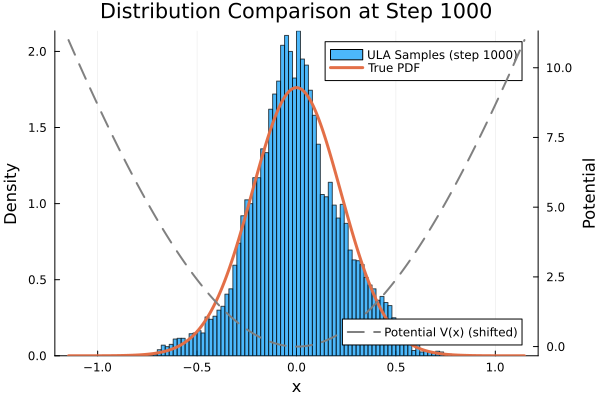 | 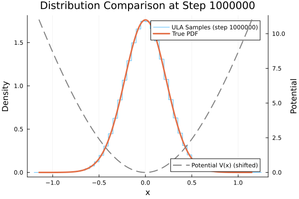 |

**Regime III: Asymmetric Potential**
| Transient ($N=10^3$) | Stationary ($N=10^6$) |
| :---: | :---: |
| 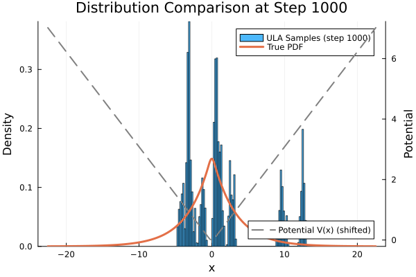 | 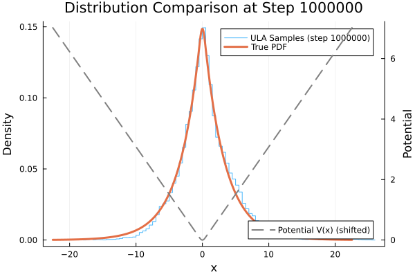 |

**Regime IV: Oscillating Tail Potential**
| Transient ($N=10^3$) | Stationary ($N=10^6$) |
| :---: | :---: |
|  | 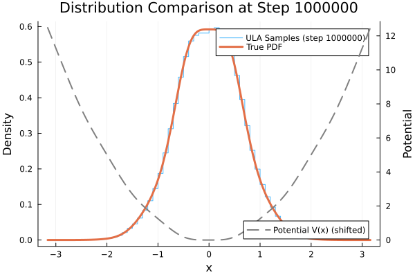 |